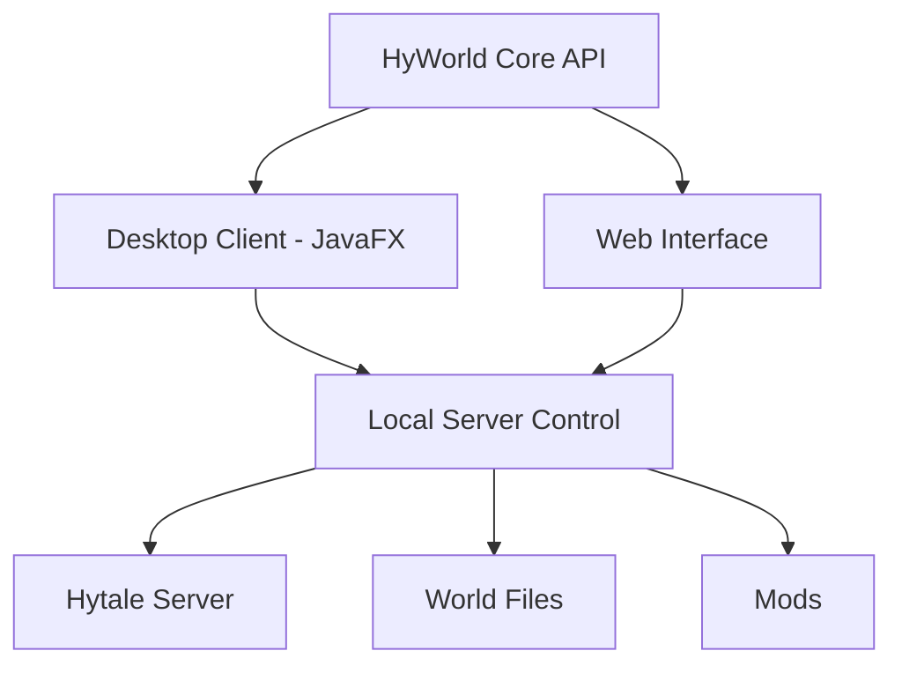

# HyWorld

**HyWorld** is a hybrid **desktop + web management platform for Hytale worlds and servers**.

It is designed to simplify world generation, server administration, and mod management while providing powerful tools for developers and server operators.

HyWorld is part of the **Cardinal ecosystem**, a suite of tools and mods designed to expand Hytale server capabilities.

---

# Overview

HyWorld provides a unified environment to:

- Create and manage Hytale worlds
- Control servers locally or remotely
- Integrate with mods and server tooling
- Visualize worlds and terrain
- Manage instances and multi-world servers

The project is inspired by tools such as:

- MultiMC / Prism Launcher
- RuneLite plugin ecosystem
- Modern server management panels

But focused specifically on **Hytale server infrastructure and mod development**.

---

# Architecture

HyWorld uses a **hybrid client architecture** allowing both desktop and web control.

The **HyWorld Core API** acts as the central control layer, allowing multiple interfaces to interact with the same server instance.

---

# Features

## World Management

- Create new worlds
- Import / export worlds
- Backup and restore saves
- Clone world templates
- Manage multiple worlds

## Server Management

- Start / stop servers
- Monitor server status
- Manage configuration
- Handle logs and diagnostics

## Mod Integration

- Install mods
- Enable / disable mods
- Manage mod load order
- Integrate with Cardinal mods

## World Instances

HyWorld supports **multi-world server architecture**, enabling:

- dungeon instances
- layered worlds
- MMO-style server zones
- temporary event maps

---

# Hybrid Control Model

HyWorld supports two main workflows:

## Desktop Mode

Ideal for:

- mod developers
- local testing
- Windows server hosts

Features:

- native UI
- fast local management
- direct filesystem access

## Web Mode

Ideal for:

- Linux servers
- remote management
- hosted servers

Features:

- browser-based interface
- remote API control
- server dashboards

Both modes communicate with the **same backend API**.

---

# Roadmap

## Phase 1 — Core Foundation

- Server launcher
- World creation
- Configuration management
- Basic desktop interface

## Phase 2 — Server Tooling

- Log viewer
- Player management
- Performance monitoring
- Backup automation

## Phase 3 — World Tools

- World preview
- Biome visualization
- Terrain analysis
- Instance management

## Phase 4 — Web Dashboard

- Browser interface
- Remote server control
- Server monitoring panels

## Phase 5 — Advanced Features

- World map viewer
- Player tracking
- Mod marketplace
- automation systems

---

# Screenshots

*(Screenshots will be added as the UI develops.)*

Planned interface previews:

- World management dashboard
- Server console panel
- Terrain viewer
- Mod management UI

---

# Cardinal Ecosystem

HyWorld integrates with the **Cardinal mod ecosystem**.

Projects include:

- **CardinalLib** — shared development framework
- **CardinalMap** — map and world visualization tools
- **CardinalSocial** — social and party systems

These tools are designed to support **large-scale Hytale servers and modded gameplay systems**.

---

# Technology

HyWorld is currently built using:

- **Java 25**
- **JavaFX (desktop client)**
- REST API backend
- JSON configuration
- Modular plugin architecture

The project is designed to be extensible for future tooling and integrations.

---

# Installation (Planned)

Future releases will provide:

- Windows executable
- Linux server packages
- Docker container support

---

# Contributing

Contributions will be welcomed once the core architecture stabilizes.

Areas that will benefit from community involvement include:

- UI development
- server tooling
- world visualization
- mod integrations

---

# Author

Created by **TriFactor**.

Part of the **Cardinal project**, focused on expanding the possibilities of Hytale servers and modding.

---

# License

License will be determined as the project matures.
